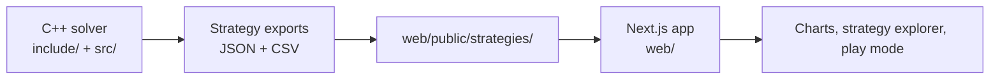
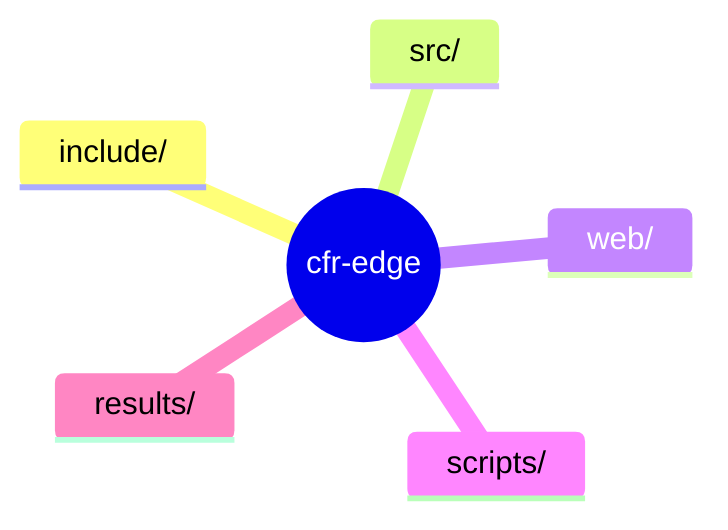

# CFR-Edge

CFR-Edge is a poker solver and visualization project built around Counterfactual Regret Minimization. The repository contains a C++17 engine for solving poker games and a Next.js app for exploring the results.

## What’s Included

- C++ solver for CFR, CFR+, DCFR, and Monte Carlo CFR
- Support for Kuhn Poker, Leduc Hold'em, and Heads-Up No-Limit Texas Hold'em
- Next.js web app for convergence charts, strategy exploration, and play-vs-strategy views
- Precomputed strategy bundles served as static files from `web/public/strategies/`

## Architecture



## Repository Layout



## Requirements

- CMake 3.16 or newer
- A C++17 compiler
- Node.js 20.9 or newer for the web app
- npm 10 or newer

## Build the Solver

```bash
cmake -B build -DCMAKE_BUILD_TYPE=Release
cmake --build build --config Release -j$(nproc)
```

## Run Experiments

```bash
./build/cfr_solver
./build/cfr_solver --kuhn-only
./build/cfr_solver --leduc-only
./build/cfr_solver --holdem-only
```

Results are written to `results/`.

## Export Strategy Data

```bash
./build/json_exporter --out ./web/public/strategies/
```

## Run the Web App

```bash
cd web
npm install
npm run dev
```

Open `http://localhost:3000`.

## Notes

The web app is static-data driven. It does not need a live solver process or backend API at runtime.