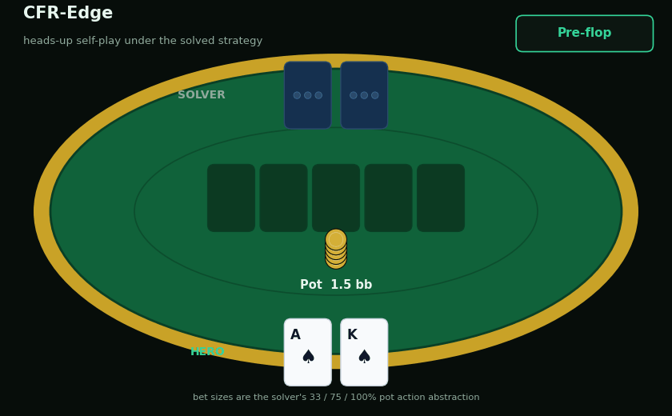
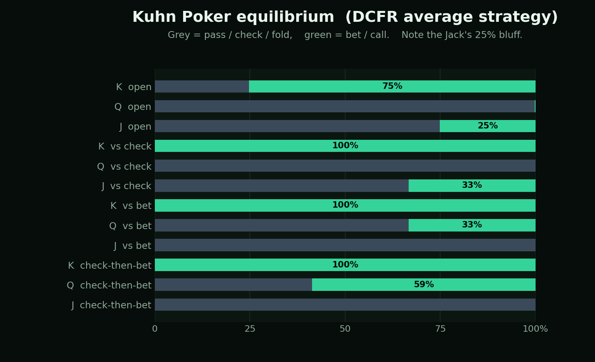
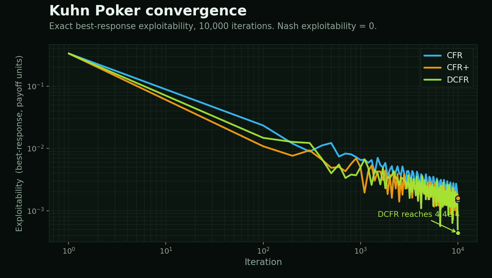
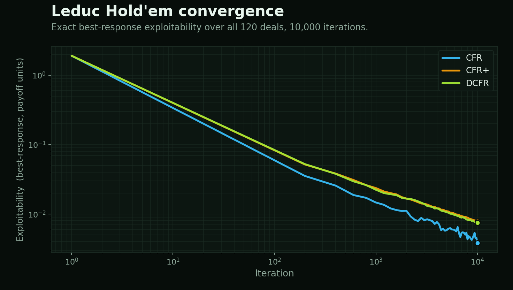
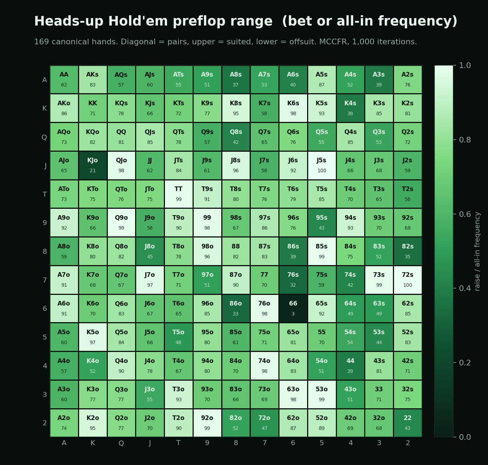
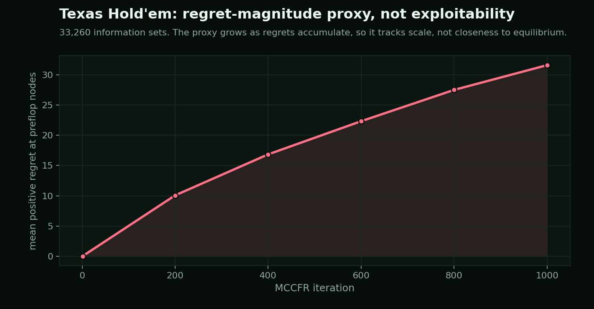

# CFR-Edge

A Counterfactual Regret Minimization poker solver written in C++17, with a static Next.js front end for inspecting the strategies it produces.

CFR-Edge solves imperfect-information poker by repeatedly walking the game tree, accumulating the regret of not having taken each action, and averaging the resulting strategies into an approximate Nash equilibrium. One engine drives three games of growing size: Kuhn Poker (12 information sets), Leduc Hold'em (288), and abstracted heads-up no-limit Texas Hold'em (33,260). For the two small games it also computes the exact best response to the average strategy, so the distance from equilibrium is measured rather than assumed. On Kuhn Poker, whose equilibrium is known and has exploitability exactly zero, the solver's average strategy reaches an exact best-response exploitability of 4.409 × 10⁻⁴ after 10,000 iterations.



*An illustrative heads-up hand played by the solver against itself. Both seats follow the trained strategy, and the bet sizes are the solver's 33%, 75%, and 100% pot action abstraction. CFR-Edge computes the equilibrium; the table is where those decisions play out.*

> Build the solver and run every experiment:
> ```bash
> cmake -B build -DCMAKE_BUILD_TYPE=Release
> cmake --build build --config Release
> ./build/cfr_solver
> ```

## Contents

[Highlights](#highlights) · [How it works](#how-it-works) · [The algorithm in equations](#the-algorithm-in-equations) · [The solved strategy](#the-solved-strategy) · [Results](#results) · [Correctness and validation](#correctness-and-validation) · [Build and run](#build-and-run) · [Project structure](#project-structure)

## Highlights

- Three CFR variants (CFR, CFR+, DCFR) share one traversal core and are selected per run, so their convergence can be compared directly on the same trees.
- Exact best-response exploitability for Kuhn and Leduc, computed by enumerating all deals (6 for Kuhn, 120 for Leduc) and grouping deals by information set, so the best-responding player cannot secretly play different actions in situations it cannot tell apart.
- On Kuhn Poker, where the equilibrium exploitability is exactly 0, DCFR reaches 4.409 × 10⁻⁴ after 10,000 iterations in about 0.02 seconds per run.
- Leduc Hold'em solved over its full 288-information-set tree, with exact exploitability between 3.834 × 10⁻³ and 7.873 × 10⁻³ depending on the variant.
- Heads-up no-limit Texas Hold'em scaled to 33,260 information sets through MCCFR external sampling, a 169-class preflop abstraction with suit isomorphism, and post-flop strength buckets.
- AVX2 and SSE2 batch regret matching over a structure-of-arrays store, with a scalar fallback so the same code builds anywhere.
- The C++ solver and the Next.js viewer stay fully decoupled through static JSON bundles, so the front end runs with no server, API, or solver binary.

## How it works

A poker hand is a tree of decisions in which each player sees only part of the state. An information set is everything one player can observe at a decision point (its own cards and the public betting history) and nothing else. CFR plays the game against itself for many iterations. At every information set it tracks, for each action, how much better off it would have been had it always taken that action, weighted by the probability the opponent's play would have led there. Those cumulative regrets are turned into the next iteration's strategy by regret matching (play each action in proportion to its positive regret). The strategy that converges to equilibrium is not the last one played but the average of all of them, which is what the solver stores and exports.

Exploitability measures how far a strategy is from equilibrium: it is the average amount a perfectly best-responding opponent can win against it, in the game's own payoff units. It is zero at a Nash equilibrium and positive otherwise.

### The three variants

All three variants share the same tree traversal and regret-matching step. They differ only in how negative regrets are handled and how much each iteration contributes to the stored average strategy.

| Variant | Negative regrets | Positive-regret discount | Average-strategy weight |
|---------|------------------|--------------------------|-------------------------|
| CFR | kept | none | 1 |
| CFR+ | floored to 0 each iteration | none | t |
| DCFR | floored to 0 each iteration | multiplied by t^1.5 / (t^1.5 + 1) | t² |

DCFR uses the discounting scheme of Brown and Sandholm (2019): it down-weights the noisy early iterations and the regrets they produce. The factors above (alpha = 1.5 for the discount, quadratic strategy weighting) are the values used in the code.

### The three games

| Game | Information sets | Method | Exploitability |
|------|------------------|--------|----------------|
| Kuhn Poker | 12 | Full-tree CFR, exact best response over 6 deals | Exact |
| Leduc Hold'em | 288 | Full-tree CFR, exact best response over 120 deals | Exact |
| HUNL Texas Hold'em | 33,260 | MCCFR external sampling, 169-class preflop plus 8 strength buckets | Regret proxy |

Kuhn and Leduc are small enough to traverse completely, so their exploitability is the true best-response value, not an estimate. Texas Hold'em is far too large for that. It is handled with Monte Carlo CFR using external sampling: each iteration samples one full deal, expands every action for the traversing player, and samples a single action for the opponent from the current strategy. Cards are abstracted into 169 canonical preflop classes (suit isomorphism collapses the 1,326 starting hands) and, after the flop, into 8 buckets by 7-card hand-evaluation rank. Bet sizes are 33%, 75%, and 100% of the pot plus all-in, capped at four bets per street, with 100 big-blind stacks.

### Engine components

| Component | Location | Role |
|-----------|----------|------|
| Variant engine | `src/cfr.cpp`, `include/cfr.h` | Training dispatch and the structure-of-arrays Kuhn path |
| Kuhn Poker | `src/kuhn.cpp` | Traversal, information-set keys, exact best response |
| Leduc Hold'em | `src/leduc.cpp`, `include/leduc_utils.h` | Two-round tree, showdown, exact best response |
| Texas Hold'em | `src/holdem.cpp` | MCCFR external sampling and card abstraction |
| Hand evaluator | `src/hand_eval.cpp` | 5- and 7-card hand ranking into the nine standard categories |
| Abstraction | `src/abstraction.cpp` | Card buckets and action reduction for Leduc |
| SIMD kernels | `include/simd_utils.h` | AVX2 and SSE2 batch regret matching, flooring, and discounting |
| SoA store | `include/soa_store.h` | Action-major storage grouped by action count for batch updates |
| JSON export | `include/json_output.h`, `src/json_exporter.cpp` | Strategy bundles for the viewer |
| Web viewer | `web/` | Next.js app reading the static bundles |

The structure-of-arrays store groups information sets by their number of actions and lays out regrets action-major, so regret matching can run across many nodes at once. The SIMD kernels process four double-precision values per AVX2 instruction (two under SSE2), and fall back to scalar code when neither is available. The store provides two-action and three-action kernels and is exercised by the Kuhn solver; the larger games use the per-node layout.

### Web viewer

The front end is a Next.js 16 and React 19 application (TypeScript, Tailwind, Recharts, D3, three.js, Zustand). It reads only the JSON under `web/public/strategies/`, so it deploys as static files. It provides:

- a convergence view that plots CFR, CFR+, and DCFR exploitability together and scrubs the strategy through stored iteration snapshots,
- a strategy explorer that lists every information set with its action probabilities, entropy, and largest regret, with filtering, sorting, and CSV export,
- a Kuhn Poker table where you play against the solved DCFR strategy and each decision is scored against its exact expected value,
- a 13 by 13 Texas Hold'em preflop range chart with raise, call, fold, and all-in views,
- an annotated walkthrough of the core C++ snippets.

## The algorithm in equations

The same definitions drive every game. Let $\sigma$ be a strategy profile, $I$ an information set belonging to player $i$, and $Z_I$ the terminal histories that pass through $I$. The counterfactual value of $I$ weights each outcome by the probability that everyone except $i$ (chance included) played to reach it:

$$
v_i(I, \sigma) = \sum_{z \in Z_I} \pi^{\sigma}_{-i}(z)\, u_i(z)
$$

The instantaneous regret of an action is how much better the player would have done by committing to that action at $I$, and cumulative regret sums it across iterations:

$$
r^t(I, a) = v_i\!\left(I, \sigma^t_{I \to a}\right) - v_i\!\left(I, \sigma^t\right),
\qquad
R^T(I, a) = \sum_{t=1}^{T} r^t(I, a)
$$

Regret matching turns positive cumulative regret into the next strategy (uniform when no regret is positive):

$$
\sigma^{T+1}(I, a) = \frac{R^{T,+}(I, a)}{\sum_{b} R^{T,+}(I, b)},
\qquad R^{+} = \max(R, 0)
$$

The strategy that actually converges is the reach-weighted average over all iterations, with the per-iteration weight $w_t$ being the only difference between the variants:

$$
\bar{\sigma}^T(I, a) = \frac{\sum_{t=1}^{T} w_t\, \pi^{\sigma^t}_i(I)\, \sigma^t(I, a)}{\sum_{t=1}^{T} w_t\, \pi^{\sigma^t}_i(I)},
\qquad
w_t^{\text{CFR}} = 1,\;\; w_t^{\text{CFR+}} = t,\;\; w_t^{\text{DCFR}} = t^2
$$

DCFR additionally discounts the accumulated positive regret at the start of each iteration before adding the new regret, with negatives reset to zero:

$$
R^{t}(I,a) \leftarrow \max\!\left(R^{t-1}(I,a),\, 0\right) \cdot \frac{t^{1.5}}{t^{1.5} + 1} \; + \; r^{t}(I,a)
$$

Exploitability is the average of both players' best-response values against the profile, which is $0$ at a Nash equilibrium:

$$
e(\sigma) = \tfrac{1}{2}\left( \max_{\sigma_1'} u_1(\sigma_1', \sigma_2) + \max_{\sigma_2'} u_2(\sigma_1, \sigma_2') \right)
$$

CFR's regret is bounded by $R^T_i \le \Delta_i\, |\mathcal{I}_i|\, \sqrt{|A_i|}\, \sqrt{T}$, so average regret and exploitability shrink on the order of $O(1/\sqrt{T})$. The measured rates below sit near that bound.

## The solved strategy

The Kuhn equilibrium is small enough to read directly, and the solved strategy reproduces its known structure: the King always bets and calls, the Jack bluffs at a fixed low rate, and the Queen is the indifferent hand that mixes its calls.



*The DCFR average strategy at every Kuhn information set. The Jack open-bets 25% of the time as a bluff, the King value-bets 75% and never folds, and the Queen checks first then calls a raise about 59% of the time. This matches the analytically known equilibrium family, which is the first sanity check that the regret updates are correct.*

## Results

The exploitability and timing figures below come from the single run that produced the committed strategy bundles in `web/public/strategies/`. The solver is single-threaded, and the run's exact CPU is not recorded in the repository.

The empirical convergence rate alpha fits exploitability to a power law (exploitability is roughly C · T^(-alpha)) by least squares on the second half of each curve. A larger alpha means faster convergence.

### Kuhn Poker

10,000 iterations, 12 information sets, about 0.02 seconds per run.

| Variant | Final exploitability | Convergence rate alpha |
|---------|----------------------|------------------------|
| CFR | 1.486 × 10⁻³ | 0.532 |
| CFR+ | 1.585 × 10⁻³ | 0.496 |
| **DCFR** | **4.409 × 10⁻⁴** | **0.605** |



*Exact best-response exploitability against iterations, log axes. DCFR reaches an exploitability about three times lower than the other two and converges faster. The CFR rate near 0.5 lines up with the theoretical O(1/sqrt(T)) regret bound.*

### Leduc Hold'em

10,000 iterations, 288 information sets, about 7 seconds per run.

| Variant | Final exploitability | Convergence rate alpha |
|---------|----------------------|------------------------|
| **CFR** | **3.834 × 10⁻³** | **0.549** |
| CFR+ | 7.873 × 10⁻³ | 0.480 |
| DCFR | 7.542 × 10⁻³ | 0.497 |



*On Leduc the three variants land close together, and at 10,000 iterations vanilla CFR (blue) produced the lowest exploitability of the three. The ranking is sensitive to the iteration count, which is why the convergence curves matter more than any single end point.*

### Texas Hold'em

1,000 MCCFR iterations build 33,260 information sets in about 6.76 seconds. The export includes a 169-class preflop range summary, which feeds the viewer's range chart and the figure below.



*Bet or all-in frequency for each of the 169 canonical starting hands, read straight from the exported preflop summary. Strong hands in the upper left lean toward raising and shoving, which is the shape an equilibrium range is expected to take.*

Because a true best response over the full game is intractable here, the reported convergence number is a proxy: the mean positive regret at preflop nodes. That quantity grows as regrets accumulate, so it tracks training progress and scale rather than closeness to equilibrium. This part of the project demonstrates the abstraction and the sampling pipeline at scale, not a solved game.



*The Texas Hold'em number is a regret-magnitude proxy, not an exploitability. It increases from 0.012 to 31.6 over 1,000 iterations as regrets accumulate, so it is shown here as a measure of scale, not of optimality.*

## Correctness and validation

The strongest check is Kuhn Poker, whose equilibrium is known in closed form. The first-player game value is -1/18 (about -0.0556) and the equilibrium exploitability is exactly 0. The solver's average strategy is scored by an exact best response and converges toward that value.

| Game | Reference | What is checked | Result |
|------|-----------|-----------------|--------|
| Kuhn Poker | Analytic Nash equilibrium, exploitability 0, first-player value -1/18 | Exact best-response exploitability of the average strategy | 4.409 × 10⁻⁴ at 10,000 iterations (DCFR), decreasing toward 0 |
| Leduc Hold'em | No closed form; exact best response over all 120 deals | Exact best-response exploitability of the average strategy | 3.834 × 10⁻³ at 10,000 iterations (CFR) |

The best response is computed at the information-set level. All deals are evaluated together and grouped by the information set they reach, so the best-responding player chooses one action per information set rather than peeking at the hidden cards behind it. A per-deal best response would let it act on information it should not have and would understate exploitability. The structure-of-arrays Kuhn path runs the same convergence alongside the per-node path, so the two can be compared on identical input.

The hand evaluator ranks 5-card hands into the nine standard categories and ranks 7-card hands by taking the best of their 21 five-card combinations. Category ordering is exact; within the high-card category the tie-break uses an approximate ordinal encoding, which is sufficient for the strength bucketing it feeds.

## Build and run

### C++ solver

Requirements: a C++17 compiler and CMake 3.16 or newer. The single-header `nlohmann/json` dependency is fetched automatically during configuration. The Release configuration enables AVX2 (`-march=native` on GCC and Clang, `/arch:AVX2` on MSVC) and link-time optimization.

```bash
cmake -B build -DCMAKE_BUILD_TYPE=Release
cmake --build build --config Release
./build/cfr_solver
```

On a multi-configuration generator such as Visual Studio, the binaries are written to `build/Release/` rather than `build/`.

`cfr_solver` runs Kuhn, Leduc, the Leduc abstraction comparison, and Texas Hold'em, printing an exploitability report for each and writing convergence CSVs into `results/`. Flags narrow the run:

```bash
./build/cfr_solver --kuhn-only     # Kuhn only
./build/cfr_solver --leduc-only    # Leduc only
./build/cfr_solver --holdem-only   # Texas Hold'em only
./build/cfr_solver --no-abstract   # skip the abstraction comparison
./build/cfr_solver --no-holdem     # skip Texas Hold'em
```

### Strategy export

A separate binary regenerates the JSON bundles the viewer reads:

```bash
./build/json_exporter --out ./web/public/strategies/
```

This writes `kuhn_cfr.json`, `kuhn_cfr_plus.json`, `kuhn_dcfr.json`, the three Leduc files, `holdem_dcfr.json`, and an index `meta.json`. The figures in this README are rendered from those bundles.

### Web viewer

```bash
cd web
npm install
npm run dev
```

Open `http://localhost:3000`. The app reads only the static JSON under `web/public/strategies/`, so it needs no server, API, or running solver. `npm run build` produces a static production build.

## Project structure

| Path | Contents |
|------|----------|
| `include/` | Headers for the engine, games, abstraction, SIMD, and JSON output |
| `src/` | Solver implementations, the experiment driver, and the exporter |
| `web/` | Next.js viewer, components, and the static strategy bundles |
| `assets/` | Figures and the animation rendered from the strategy bundles |
| `results/` | Convergence CSVs written by `cfr_solver` |

## References

1. Zinkevich, M., Johanson, M., Bowling, M., and Piccione, C. (2007). Regret minimization in games with incomplete information. Advances in Neural Information Processing Systems, 20.
2. Tammelin, O. (2014). Solving large imperfect information games using CFR+. arXiv:1407.5042.
3. Brown, N., and Sandholm, T. (2019). Solving imperfect-information games via discounted regret minimization. Proceedings of the AAAI Conference on Artificial Intelligence, 33(1), 1829-1836.
4. Lanctot, M., Waugh, K., Zinkevich, M., and Bowling, M. (2009). Monte Carlo sampling for regret minimization in extensive games. Advances in Neural Information Processing Systems, 22.

## License

This repository does not currently include a license file, so default copyright applies and all rights are reserved by the author.
